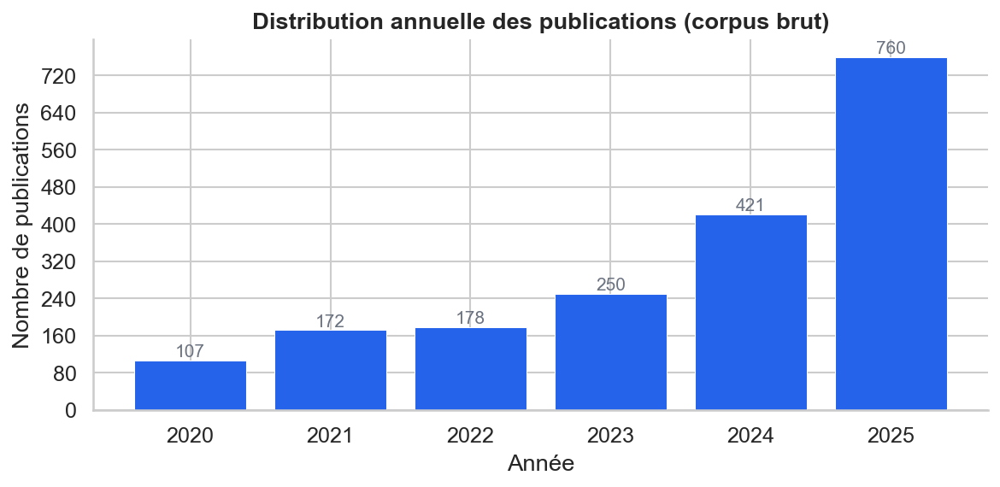
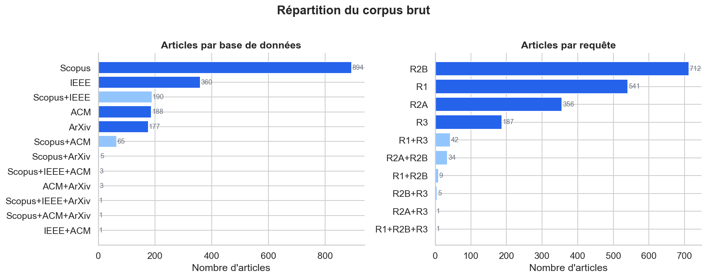
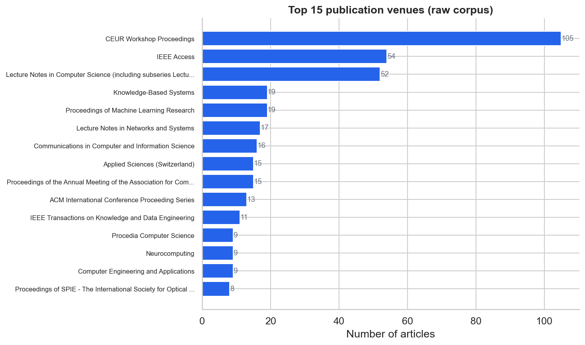
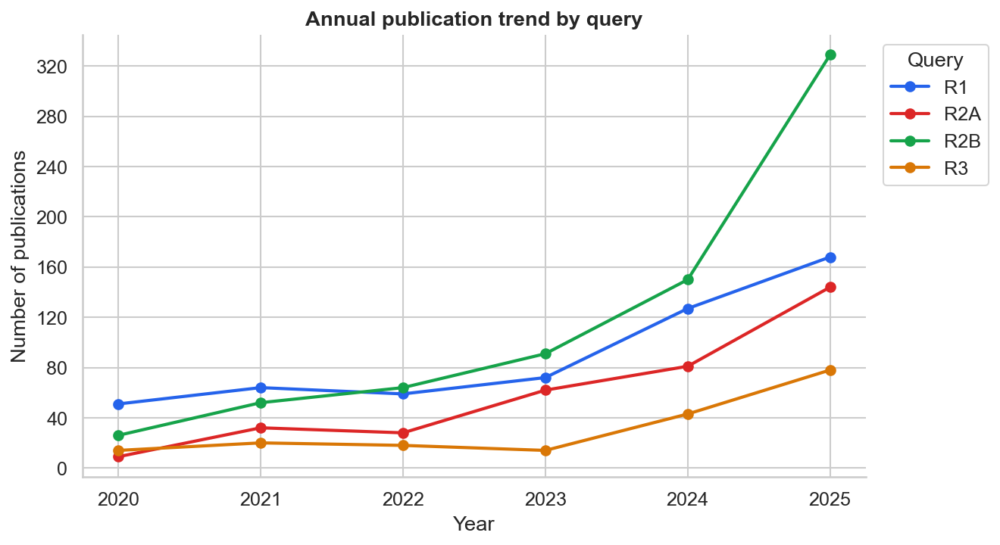
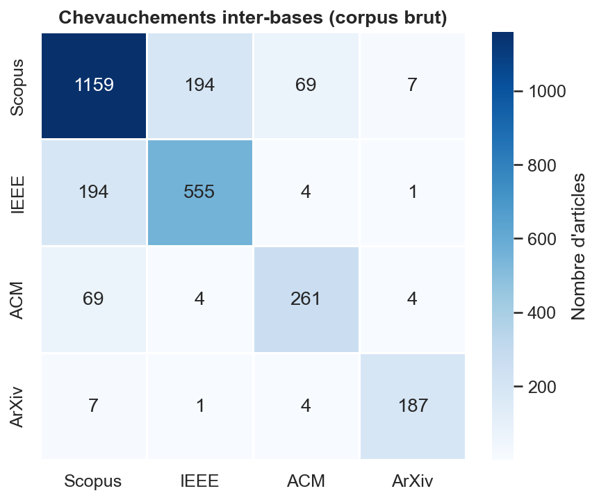
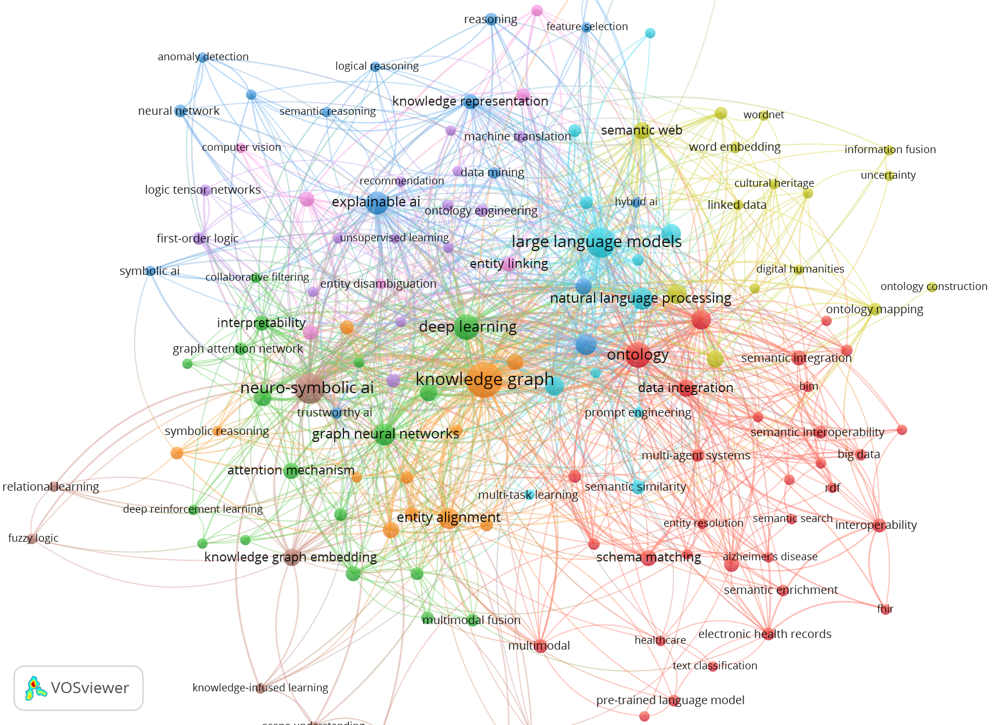
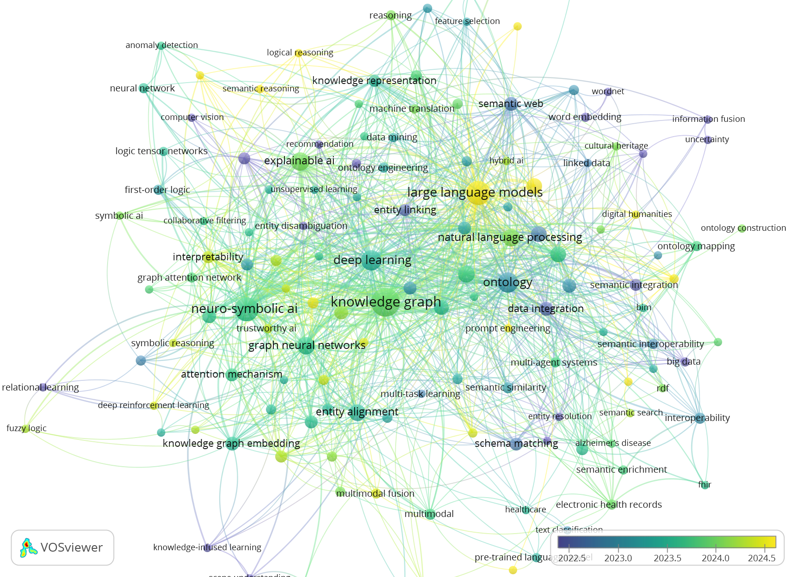

# SLR — Appariement sémantique neuro-symbolique d'indicateurs multilingues hétérogènes

> **Mémoire de maîtrise en informatique (IA)**  
> Constance Lambert-Tremblay · Université du Québec en Outaouais (UQO)  
> Directeur : Pr Étienne Gaël Tajeuna  
> Méthodologie : Carrera Rivera et al. (2022) · Protocole v3 · Février 2026

---

## Sujet

Ce dépôt contient le pipeline de revue systématique de la littérature (RSL) réalisé dans le cadre d'un mémoire portant sur l'**appariement sémantique explicable d'indicateurs de suivi-évaluation (S&É) hétérogènes et multilingues**, dans un contexte de développement international (Socodevi).

L'approche proposée est **neuro-symbolique** : elle combine des embeddings de transformers multilingues avec des graphes de connaissances structurels et une boucle de validation interactive par des experts (Human-in-the-Loop).

### Questions de recherche

| # | Question |
|---|----------|
| RQ1 | Quelles architectures neuro-symboliques existent pour l'appariement sémantique de données hétérogènes ? |
| RQ2 | Comment l'explicabilité et la validation interactive (HITL) sont-elles intégrées dans ces approches ? |
| RQ3 | Quels sont les contextes d'application (multilinguisme, S&É, intégration de données) ? |

---

## État d'avancement

| Phase | État | Détail |
|-------|------|--------|
| Protocole| ✅ Complété | Critères I/E finalisés, DEC-001 à DEC-017 documentées |
| Collecte (4 bases) | ✅ Complété | Scopus, IEEE Xplore, ACM, arXiv — 27 fév. 2026 |
| Fusion & déduplication | ✅ Complété | 1 890 → 1 888 articles (E6) → 457 scorés |
| Bibliométrie pré-screening | ✅ Complété | Notebook + VOSviewer avec thesaurus |
| **Tri #1** (titre/résumé) | 🔄 **En cours** | 795/1 888 screenés (42,1 %) — 110 inclus, 30 surveys |
| Tri #2 (Quality Assessment) | ⏳ À venir | Grille Q1–Q6, seuil 3/5 |
| Tri #3 (extraction A.5) | ⏳ À venir | Formulaire complet |
| Synthèse & rédaction | ⏳ À venir | Cible : ESWA |

---

## Structure du dépôt

```
slr-nesy-data-harmonization/
├── src/
│   ├── fetch_arxiv.py          # Collecte via API arXiv
│   ├── normalize.py            # Normalisation champs inter-bases
│   ├── deduplication.py        # Dédoublonnage (DOI exact + fuzzy titre ≥ 95 %)
│   ├── scoring.py              # Score TF-IDF par pertinence
│   ├── preclassify.py          # Pré-classification NLP (règles I/E)
│   ├── screening_app.py        # Interface Streamlit — Tri #1
│   ├── validate_bulk.py        # Validation des actions en lot
│   └── generate_thesaurus.py   # Génération du thesaurus VOSviewer
├── run_deduplication.py        # Script de lancement dédoublonnage
├── run_fetch_arxiv.py          # Script de lancement collecte arXiv
├── data/
│   ├── raw/
│   │   ├── scopus/             # Exports CSV par requête (R1, R2A, R2B, R3)
│   │   ├── ieee/
│   │   ├── acm/
│   │   └── arxiv/
│   ├── processed/
│   │   ├── corpus_dedup_final.csv   # 1 888 articles après E6
│   │   └── corpus_scored.csv        # 457 articles scorés + colonnes NLP
│   └── logs/
│       └── dedup_log.txt
├── results/
│   ├── figures/                # Figures bibliométriques + VOSviewer
│   ├── qa/                     # Résultats Tri #2
│   └── tables/                 # Tables exportées
├── notebooks/
│   └── 02_bibliometrie_phase1.ipynb
├── docs/
│   └── decisions_log.md        # Journal des décisions DEC-001 à DEC-017
└── requirements.txt
```

---

## Pipeline

```
Collecte (Scopus / IEEE / ACM / arXiv)
        ↓
   normalize.py          → champs uniformisés par base
        ↓
  deduplication.py       → DOI exact + fuzzy titre ≥ 95 %
        ↓                   1 890 → 1 888 → 457 articles uniques
    scoring.py           → score TF-IDF (0–100 %), tri par rang
        ↓
  preclassify.py         → suggestion NLP (include/exclude/survey/uncertain)
        ↓                   + confiance (high/medium/low) + tag explicatif
  screening_app.py       → interface Streamlit — décision humaine finale
        ↓
   [Tri #2 QA]           → grille Q1–Q6, seuil 3/5
        ↓
   [Tri #3 extraction]   → formulaire A.5
```

---

## Installation

```bash
git clone https://github.com/clambert2648/slr-nesy-data-harmonization.git
cd slr-nesy-data-harmonization
pip install -r requirements.txt
```

**Dépendances principales :** `pandas`, `scikit-learn`, `fuzzywuzzy`, `python-Levenshtein`, `streamlit`, `arxiv`, `openpyxl`

---

## Lancement de l'interface de screening

```bash
# 1. Générer les scores TF-IDF (si pas déjà fait)
python src/scoring.py

# 2. Générer les suggestions NLP
python src/preclassify.py

# 3. Lancer l'interface Streamlit
streamlit run src/screening_app.py
```

L'interface s'ouvre sur `http://localhost:8501` et propose trois onglets :

- **Screening** — article par article, avec bandeau NLP coloré (suggestion + confiance + tag), bouton d'acceptation rapide pour les articles haute confiance, actions en lot dans la sidebar
- **Révision** — tableau searchable des décisions déjà enregistrées, modification inline
- **Dashboard** — métriques de progression, distribution des décisions, accord NLP/humain

> **Note :** `data/` n'est pas versionné (données brutes non distribuées). Pour utiliser le pipeline, placer les exports CSV des bases dans `data/raw/{scopus,ieee,acm,arxiv}/`.

---

## Critères d'inclusion/exclusion (Protocole v3)

**Inclusion** — toutes les conditions doivent être vraies, avec I2 ou I3 requis (optionnel) :

| ID | Critère |
|----|---------|
| I1 | Article de revue ou acte de conférence évalué par les pairs, 2020–2025 |
| I2 | Tâche d'appariement / alignement / mapping / harmonisation de données hétérogènes |
| I3 | Explicabilité ou interprétabilité des décisions d'appariement (HITL) — *optionnel : I2 ou I3 suffit* |
| I4 | Approche neuro-symbolique / hybride neural+symbolique (KG/ontologie/règles + embeddings/transformers) |
| I5 | Évaluation empirique : au moins un dataset + une métrique |
| I6 | Full text accessible |

**Exclusion** — une condition suffit :

| ID | Critère |
|----|---------|
| E1 | Hors tâche : KG completion, link prediction, classification, QA, recommandation *(exception : entity alignment inter-KG si I2 explicite)* |
| E2 | Hors modalités : images/vidéo/audio/signaux sans composante textuelle |
| E3 | Méthode non algorithmique : harmonisation manuelle, discussion conceptuelle |
| E4 | Pas d'évaluation : papier position/vision sans résultats |
| E5 | Type non retenu : thèse, rapport, chapitre, éditorial, poster *(surveys → snowballing)* |
| E6 | Hors période (< 2020 ou > 2025) ou langue sans abstract exploitable |

---

## Bibliométrie — aperçu du corpus

### Distribution annuelle (corpus brut, 1 888 articles)



Croissance marquée à partir de 2023, pic en 2025 (760 articles) — confirme l'effervescence du domaine NeSy+KG.

### Répartition par base et par requête



Scopus domine (894 articles uniques). R2B est la requête la plus large (712 articles), R3 la plus ciblée (187). Le chevauchement inter-bases est faible — chaque source contribue de manière complémentaire.

### Top venues de publication



**Knowledge-Based Systems** (19 articles) et **IEEE Transactions on Knowledge and Data Engineering** (11 articles) sont les revues spécialisées les plus représentées — deux cibles naturelles pour la publication des résultats.

### Évolution par requête



R2B (approches hybrides neurales+symboliques) connaît une croissance exponentielle depuis 2023, reflétant l'essor des LLMs combinés à des structures symboliques.

### Chevauchements inter-bases



Faible recouvrement entre bases (Scopus↔IEEE : 194 ; Scopus↔ACM : 69) — justifie l'interrogation des 4 sources.

### Carte de co-occurrence de mots-clés (VOSviewer)



*60 mots-clés, seuil ≥ 3 occurrences, full counting — VOSviewer 1.6.20 avec thesaurus de normalisation*

**Clusters principaux identifiés :**
- 🟠 **NeSy core** : *knowledge graph*, *entity alignment*, *graph neural networks*, *knowledge graph embedding*
- 🟣 **Explicabilité / XAI** : *explainable AI*, *interpretability*, *symbolic AI*, *trustworthy AI*
- 🔴 **Appariement sémantique** : *schema matching*, *ontology mapping*, *semantic similarity*, *data integration*
- 🔵 **LLM émergents** : *large language models*, *natural language processing*, *entity linking*
- 🟡 **Web sémantique** : *semantic web*, *ontology*, *linked data*, *RDF*

### Overlay temporel (années de publication)



*Couleur = année médiane de publication (violet → 2022, jaune → 2024.5)*

Les termes LLM-centrés (*large language models*, *prompt engineering*) apparaissent très récemment (2024+), tandis que les fondations symboliques (*ontology*, *semantic web*, *schema matching*) ont une présence plus ancienne et stable.

---

## Décisions méthodologiques

Le journal `docs/decisions_log.md` documente toutes les décisions prises depuis le début du projet (DEC-001 à DEC-022), incluant la justification, les limites reconnues et l'impact PRISMA de chaque choix.

Décisions clés :
- **DEC-001 à DEC-004** — Ajout ACM Digital Library (champ Abstract, filtre Research Article)
- **DEC-007 à DEC-008** — Inclusion arXiv via API Python
- **DEC-009** — Dédoublonnage deux passes (DOI exact + fuzzy ≥ 95 %)
- **DEC-013 à DEC-015** — Développement des outils NLP (scoring, pré-classification, Streamlit)
- **DEC-014** — Reformulation I3 (explicabilité) et retrait clause baseline de I4
- **DEC-016** — Paramètres VOSviewer (seuil 3, 60 mots-clés, full counting)

---

## Références méthodologiques

- Carrera Rivera, A. et al. (2022). How to conduct a systematic literature review: A quick guide for computer science research. *MethodsX*, 9, 101895.
- Page, M. J. et al. (2021). The PRISMA 2020 statement. *BMJ*, 372, n71.
- Van Eck, N. J. & Waltman, L. (2014). Visualizing bibliometric networks. In *Measuring Scholarly Impact*, Springer.

---

*Dernière mise à jour : 1er mars 2026*
